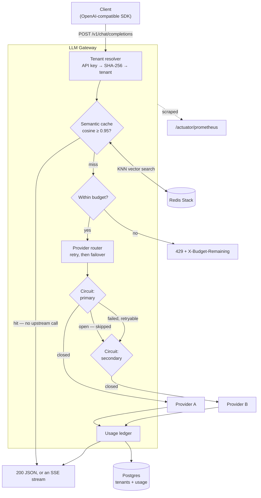
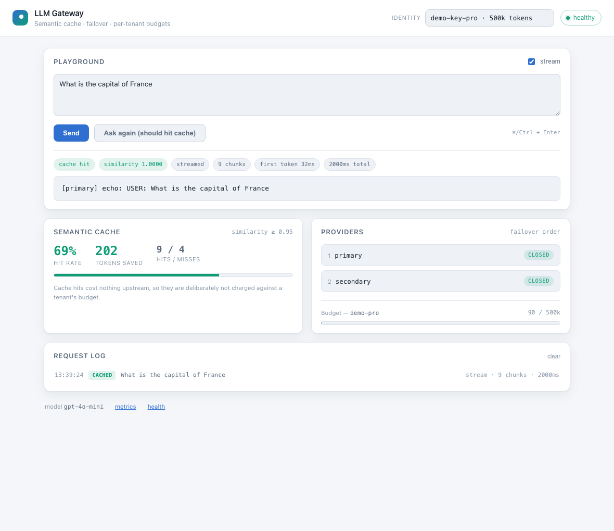

# LLM Inference Gateway

[](https://github.com/Ankitnehra6/llm-gateway/actions/workflows/ci.yml)
[](https://openjdk.org)
[](https://spring.io/projects/spring-boot)
[](LICENSE)

A gateway that sits between your application and LLM providers: semantic caching on Redis
vector search, multi-provider failover with per-upstream circuit breaking, per-tenant token
budgets backed by an append-only ledger, SSE streaming, and an OpenAI-compatible API so
existing clients need only a new base URL.

**The problem it solves.** Calling a model provider directly means your availability is
theirs, your spend is unbounded until the invoice arrives, and switching vendors is a
code change. A gateway makes failover a configuration line, spend a hard limit that is
enforced before the request is made, and the provider an implementation detail.

On a workload of 200 requests drawn from 20 distinct prompts, the semantic cache served
**90% of them**, saved **5,056 tokens**, and answered **10.9× faster** than a miss.

---

## Contents

- [Architecture](#architecture)
- [Console](#console)
- [Quickstart](#quickstart)
- [What it does](#what-it-does)
- [Verified behaviour](#verified-behaviour)
- [Design decisions](#design-decisions)
- [Configuration](#configuration)
- [Testing](#testing)
- [Roadmap](#roadmap)

---

## Architecture



---

## Quickstart

Runs with **no API key and no network access**. Both configured providers are a local
deterministic stand-in, because everything worth demonstrating here — caching, failover,
circuit breaking, budget enforcement, accounting — is about the gateway, not about the
quality of an upstream's prose.

```bash
make up      # gateway, Postgres, Redis Stack, Prometheus
make smoke   # sends real requests and shows what came back
make down
```

| What | Where |
|---|---|
| **Console** | **<http://localhost:8080>** |
| API | <http://localhost:8080/v1/chat/completions> |
| Health | <http://localhost:8080/actuator/health> |
| Metrics | <http://localhost:8080/actuator/prometheus> |
| Prometheus | <http://localhost:9091> |

A request by hand:

```bash
curl -s -X POST http://localhost:8080/v1/chat/completions \
  -H 'Authorization: Bearer demo-key-pro' \
  -H 'Content-Type: application/json' \
  -d '{"model":"gpt-4o-mini","messages":[{"role":"user","content":"hello gateway"}]}'
```

```json
{
  "id": "chatcmpl-58bcad40-55f8-45b1-b16c-d4c74c5486ae",
  "model": "gpt-4o-mini",
  "content": "[primary] echo: USER: hello gateway",
  "usage": { "prompt_tokens": 5, "completion_tokens": 9, "total_tokens": 14 },
  "gateway": {
    "provider": "primary",
    "cache_hit": false,
    "failed_over": false,
    "attempts": [{ "provider": "primary", "outcome": "success", "elapsed_ms": 42 }],
    "budget_remaining": 499986
  }
}
```

The `gateway` block is namespaced away from the vendor-compatible fields, so a client
parsing the standard schema can ignore it entirely — but when something goes wrong, the
route the request actually took is right there in the response rather than only in logs.

**Demo keys** (seeded by the first migration, for local use only): `demo-key-free`
(5,000 tokens), `demo-key-pro` (500,000), `demo-key-internal` (10,000,000).

---

## Console

A single-page console is served from the jar at `/` — no separate frontend build, no CDN,
no privileged endpoint. It talks to the same public API any SDK would.



Ask something, then ask it again: the second answer arrives with a **cache hit** badge and
its similarity score, and the request log marks it `CACHED`. Switch identity in the header
to watch a different tenant's budget, or drain the 5,000-token free tier and see the 429
surface as a problem document.

- **Playground** — streams token by token, with a live caret; badges report which provider
  answered, whether it was cached, the similarity, chunk count and time to first token
- **Semantic cache** — hit rate, tokens saved, and the configured threshold
- **Providers** — the failover chain in order, with each circuit breaker's state
- **Budget** — the selected tenant's spend against its limit

`?q=your+prompt&run=1` prefills and sends on load, so a demo can be linked rather than
described.

A detail worth noting: SSE chunks carry no metadata in the OpenAI schema, so a streamed
cache hit would be indistinguishable from a streamed upstream call. The gateway attaches
its `gateway` block to the **terminating** chunk — clients that only understand the vendor
schema ignore the extra field, and this console uses it to label the response honestly.

---

## What it does

**Semantic caching.** Each answer is stored with its prompt's embedding and indexed by
RediSearch. A lookup runs a vector KNN query and serves the nearest prior answer when the
cosine similarity clears a threshold, so "How do I reverse a list in Java" and "how do i
reverse a list in java?" cost one upstream call between them.

**Streaming.** `"stream": true` switches the response to server-sent events in the OpenAI
chunk format. Cache hits are replayed as a stream too, so a client cannot tell a cached
answer from a generated one by its shape.

**Multi-provider failover.** Providers are tried in configuration order. The first that
supports the requested model and whose circuit is closed serves the request.

**Retry, then failover.** A transient blip is retried against the same provider with
exponential backoff and jitter; a provider that is actually down is abandoned. Doing only
failover means one flaky response permanently demotes a healthy provider; doing only retry
means a dead one gets hammered instead of skipped.

**Per-upstream circuit breaking.** Each provider gets its own Resilience4j breaker, so a
failing upstream is skipped outright instead of costing every request a timeout before
failover.

**Retryable vs terminal failures.** Only upstream faults trigger failover. A malformed
request fails identically everywhere, so failing over would multiply the latency and the
bill without changing the outcome — the router surfaces it immediately instead.

**Per-tenant token budgets.** Checked before routing and recorded after, against an
append-only ledger in Postgres.

**Full accounting.** Every served request leaves a row: tenant, provider, model, tokens,
latency, cache outcome.

**Observability.** Micrometer → Prometheus, plus Resilience4j's breaker state.

---

## Verified behaviour

Not descriptions — these are outputs from the running stack, reproducible with
`make up && make smoke`.

### Semantic cache

200 requests drawn from 20 distinct prompts with a Zipf-like popularity skew, 30% of them
reworded to differ in case and punctuation:

| Metric | Result |
|---|---|
| Cache hits | **180 / 200 (90.0%)** |
| Tokens saved | **5,056** |
| p50 latency, cache hit | **4.50 ms** |
| p50 latency, cache miss | 49.08 ms |
| Speedup on a hit | **10.9×** |

Behaviour on specific prompts:

```
cold ask       cache_hit=False provider=primary
same again     cache_hit=True  similarity=1.0000
reworded       cache_hit=True  similarity=1.0000    ("what is the capital of france?")
different      cache_hit=False provider=primary     ("...capital of Japan")
```

A one-word change is **not** a hit at the default threshold: "reverse a list in Java" and
"reverse a list in Python" want different answers, and a cache confident enough to
conflate them is worse than no cache.

### Streaming

```
chunks received   10
time to first     49 ms
total            330 ms
```

Wire format, unmodified from the running gateway:

```
data:{"id":"chatcmpl-645d...","object":"chat.completion.chunk","model":"gpt-4o-mini",
      "choices":[{"index":0,"delta":{"content":"[primary]"}}]}
```

### Failover and circuit breaking

The primary was configured to fail 100% of calls, and eight requests were sent:

```
served by secondary  failed_over=True  route: primary(failed)       -> secondary(success)
served by secondary  failed_over=True  route: primary(failed)       -> secondary(success)
served by secondary  failed_over=True  route: primary(failed)       -> secondary(success)
served by secondary  failed_over=True  route: primary(failed)       -> secondary(success)
served by secondary  failed_over=True  route: primary(failed)       -> secondary(success)
served by secondary  failed_over=True  route: primary(circuit_open) -> secondary(success)
served by secondary  failed_over=True  route: primary(circuit_open) -> secondary(success)
served by secondary  failed_over=True  route: primary(circuit_open) -> secondary(success)
```

Five failures — the configured `minimumNumberOfCalls` — then the breaker opens and the
primary stops being called at all. Every request was still served.

### Budget enforcement

The free tier's 5,000-token allowance, driven with ~1,000-token prompts:

```
200 200 200 200 200 429 429 429 429 429
```

Exactly five requests fit. The sixth is rejected with `X-Budget-Remaining: 0` and an
RFC 9457 problem document.

### Validation

```json
{
  "type": "https://llm-gateway/errors/validation",
  "title": "Invalid request",
  "status": 400,
  "errors": ["messages[0].role: role must be system, user or assistant"]
}
```

---

## Design decisions

**A cache hit does not consume budget.** A budget caps *spend*, and a hit spends nothing
upstream. Charging for one would penalise a tenant for the gateway working well. Bounding
the request rate itself is a rate limiter's job, not a budget's. The ledger still records
what the hit *would* have cost, marked `cache_hit`, which is where the tokens-saved number
comes from.

**The similarity threshold is deliberately conservative.** 0.95, not 0.85. A wrong answer
costs far more than a missed cache, and the failure mode of a loose threshold is the
gateway confidently answering a question nobody asked.

**Vector search in Redis, not cosine in the JVM.** The candidate set is every prompt the
gateway has ever answered. Pulling that into the application to score it would turn a
cache lookup into a full scan — the cache would get slower exactly as it became more
useful.

**Cache entries are namespaced by requested model *and* embedding model.** Serving a GPT
answer to a Claude request would be wrong, and vectors from different embedding models are
not comparable. Changing the embedding model must invalidate the cache rather than
silently return nonsense.

**Streaming cannot fail over once it has started.** Bytes already on the client's socket
cannot be unsent, so switching providers mid-stream would splice two different answers into
one response. A failure after the first chunk aborts instead. This is why streaming and
buffered requests do not share a code path — the failover window closes partway through.

**Budgets are checked, not reserved.** Holding a reservation across an upstream call
would need a two-phase commit against a provider that has no notion of one, and the
failure mode — a crashed gateway leaving phantom reservations that lock a tenant out — is
worse than the one it prevents. The accepted consequence is that concurrent requests can
overshoot a limit slightly, bounded by the requests already in flight. A hard financial
cap would need the reservation; a token budget does not.

**Usage is a ledger, not a counter.** Totals can be derived from a ledger; a ledger
cannot be recovered from a total. Keeping the rows is what makes per-model cost
attribution, usage disputes and retrospective budget changes answerable at all.

**Hibernate validates, Flyway owns the schema.** `ddl-auto: validate` earned its place
immediately: it caught a real mismatch between a `CHAR(64)` column and an unannotated
entity field on the first integration run — the kind of drift that is invisible to unit
tests and fatal at startup in production.

**API keys are stored as unsalted SHA-256.** Deliberate, and safe only because API keys
are long random strings rather than user-chosen secrets. A leaked hash of a 256-bit
random key is not brute-forceable; a leaked hash of a password is. It must be computable
in one step on every request, which rules out a password hash.

**Metrics are never labelled by tenant.** Tenant identifiers are unbounded, and an
unbounded Prometheus label grows the series count until it takes the monitoring stack
down. Per-tenant numbers belong in the ledger, which is built for that query.

**Virtual threads.** A request here spends nearly all its time blocked on an upstream
HTTP call, which is exactly the workload platform threads waste memory on.

---

## Configuration

All configuration is environment variables or `application.yml`.

| Variable | Default | Description |
|---|---|---|
| `DATABASE_URL` | `jdbc:postgresql://localhost:5432/llmgateway` | Postgres JDBC URL |
| `DATABASE_USER` / `DATABASE_PASSWORD` | `llmgateway` | Credentials |
| `REDIS_HOST` / `REDIS_PORT` | `localhost` / `6379` | Redis Stack, for the semantic cache |
| `SERVER_PORT` | `8080` | Listen port |

Providers are a list, in failover order:

```yaml
gateway:
  default-model: gpt-4o-mini
  providers:
    - name: primary
      type: echo
      latency: 40ms
      failure-rate: 0.0     # raise this to watch failover happen
    - name: secondary
      type: echo
      latency: 150ms
  budget:
    enabled: true
    default-token-limit: 100000
    period: 24h
  cache:
    enabled: true
    similarity-threshold: 0.95   # the most consequential number here
    ttl: 1h
    dimensions: 256
```

The cache needs **Redis Stack**, not plain Redis — vector KNN lives in RediSearch. Against
a plain Redis the gateway still starts, logs that caching is unavailable, and serves every
request from upstream.

Circuit breaker behaviour is standard Resilience4j configuration under
`resilience4j.circuitbreaker`, keyed by provider name.

---

## Testing

```bash
make test     # unit + integration, real Postgres and Redis via Testcontainers
make verify   # full build
```

46 tests, no mocked infrastructure. The integration suite runs the actual Flyway
migrations against a real Postgres, so the entity mappings and the schema are verified
against each other rather than assumed to agree.

Worth reading:

- **`ProviderRouterTest`** — failover, circuit opening, and the case that matters most:
  a non-retryable error must *not* fail over, asserted by proving the second provider was
  never called.
- **`ChatApiIntegrationTest`** — auth, validation, budget exhaustion, streaming, and the
  guarantee that every served request leaves a ledger row. Also that a cache hit does not
  consume budget.
- **`RedisSemanticCacheTest`** — vector KNN against a real Redis Stack, including that the
  threshold is what decides a hit (same prompt pair, two thresholds, opposite outcomes)
  and that an unreachable Redis degrades to a miss instead of an error.

### If `make test` cannot find Docker

Testcontainers looks for the Docker socket where Docker Desktop puts it. Colima, Rancher
and podman put it elsewhere, and the resulting error says nothing useful. The `Makefile`
resolves it from the active `docker context`, so `make test` works on all of them —
`./mvnw test` directly will not, unless `DOCKER_HOST` is already set.

---

## Roadmap

Built:

- [x] Provider abstraction with an ordered failover chain
- [x] Per-provider circuit breaking
- [x] Retry with exponential backoff and jitter, before failover
- [x] Retryable vs terminal failure classification
- [x] **Semantic caching** on Redis vector search, with measured hit rate and savings
- [x] **SSE streaming**, including replay of cache hits as a stream
- [x] Per-tenant budgets with an append-only usage ledger
- [x] OpenAI-compatible request/response shape
- [x] RFC 9457 problem details
- [x] Prometheus metrics, including tokens saved by the cache
- [x] 46 tests, integration suite on real Postgres and Redis Stack

Not built, and deliberately so:

- [ ] **A real vendor adapter.** The `LlmProvider` interface exists for exactly this and
      the echo provider proves the seam works, but a hosted adapter cannot be honestly
      tested here without a paid key, and an untested adapter is worse than none.
- [ ] **A real embedding model.** `HashingEmbeddingModel` measures *lexical* similarity,
      not semantic — it will not match "reverse a list" to "invert an array".
      `EmbeddingModel` is the seam to swap in a hosted model.
- [ ] Prompt versioning and A/B routing
- [ ] Grafana dashboard (Prometheus is wired and scraping; only the JSON is missing)

---

## License

MIT — see [LICENSE](LICENSE).
