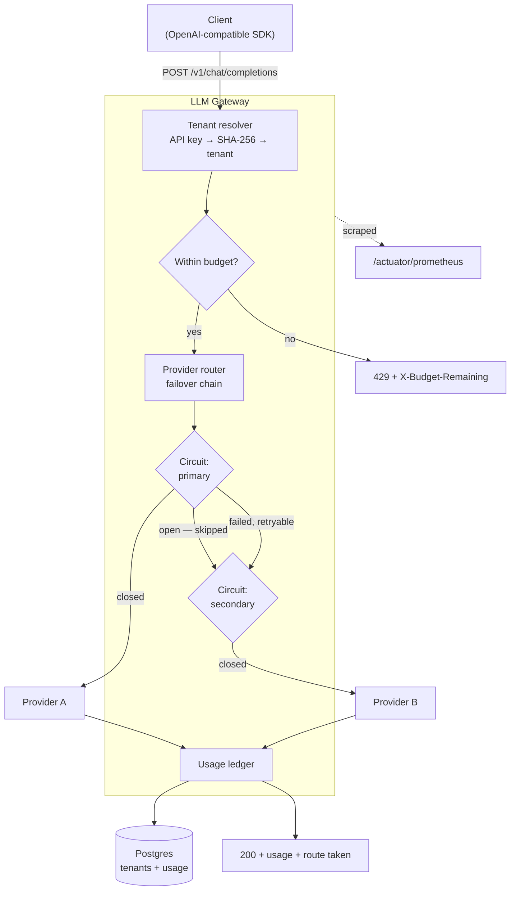

# LLM Inference Gateway

[](https://github.com/Ankitnehra6/llm-gateway/actions/workflows/ci.yml)
[](https://openjdk.org)
[](https://spring.io/projects/spring-boot)
[](LICENSE)

A gateway that sits between your application and LLM providers: multi-provider failover
with per-upstream circuit breaking, per-tenant token budgets backed by an append-only
ledger, and an OpenAI-compatible API so existing clients need only a new base URL.

**The problem it solves.** Calling a model provider directly means your availability is
theirs, your spend is unbounded until the invoice arrives, and switching vendors is a
code change. A gateway makes failover a configuration line, spend a hard limit that is
enforced before the request is made, and the provider an implementation detail.

> **Status:** the routing, budgeting and accounting core is complete and tested. Semantic
> caching and SSE streaming are the next increments — see [Roadmap](#roadmap). The
> `cache_hit` field is already on the wire and always `false` today; it is not yet
> implemented, and this README does not claim otherwise.

---

## Contents

- [Architecture](#architecture)
- [Quickstart](#quickstart)
- [What it does](#what-it-does)
- [Verified behaviour](#verified-behaviour)
- [Design decisions](#design-decisions)
- [Configuration](#configuration)
- [Testing](#testing)
- [Roadmap](#roadmap)

---

## Architecture



---

## Quickstart

Runs with **no API key and no network access**. Both configured providers are a local
deterministic stand-in, because everything worth demonstrating here — failover, circuit
breaking, budget enforcement, accounting — is about the gateway, not about the quality of
an upstream's prose.

```bash
make up      # gateway, Postgres, Redis, Prometheus
make smoke   # sends real requests and shows what came back
make down
```

| What | Where |
|---|---|
| Gateway | <http://localhost:8080> |
| Health | <http://localhost:8080/actuator/health> |
| Metrics | <http://localhost:8080/actuator/prometheus> |
| Prometheus | <http://localhost:9091> |

A request by hand:

```bash
curl -s -X POST http://localhost:8080/v1/chat/completions \
  -H 'Authorization: Bearer demo-key-pro' \
  -H 'Content-Type: application/json' \
  -d '{"model":"gpt-4o-mini","messages":[{"role":"user","content":"hello gateway"}]}'
```

```json
{
  "id": "chatcmpl-58bcad40-55f8-45b1-b16c-d4c74c5486ae",
  "model": "gpt-4o-mini",
  "content": "[primary] echo: USER: hello gateway",
  "usage": { "prompt_tokens": 5, "completion_tokens": 9, "total_tokens": 14 },
  "gateway": {
    "provider": "primary",
    "cache_hit": false,
    "failed_over": false,
    "attempts": [{ "provider": "primary", "outcome": "success", "elapsed_ms": 42 }],
    "budget_remaining": 499986
  }
}
```

The `gateway` block is namespaced away from the vendor-compatible fields, so a client
parsing the standard schema can ignore it entirely — but when something goes wrong, the
route the request actually took is right there in the response rather than only in logs.

**Demo keys** (seeded by the first migration, for local use only): `demo-key-free`
(5,000 tokens), `demo-key-pro` (500,000), `demo-key-internal` (10,000,000).

---

## What it does

**Multi-provider failover.** Providers are tried in configuration order. The first that
supports the requested model and whose circuit is closed serves the request.

**Per-upstream circuit breaking.** Each provider gets its own Resilience4j breaker, so a
failing upstream is skipped outright instead of costing every request a timeout before
failover.

**Retryable vs terminal failures.** Only upstream faults trigger failover. A malformed
request fails identically everywhere, so failing over would multiply the latency and the
bill without changing the outcome — the router surfaces it immediately instead.

**Per-tenant token budgets.** Checked before routing and recorded after, against an
append-only ledger in Postgres.

**Full accounting.** Every served request leaves a row: tenant, provider, model, tokens,
latency, cache outcome.

**Observability.** Micrometer → Prometheus, plus Resilience4j's breaker state.

---

## Verified behaviour

Not descriptions — these are outputs from the running stack, reproducible with
`make up && make smoke`.

### Failover and circuit breaking

The primary was configured to fail 100% of calls, and eight requests were sent:

```
served by secondary  failed_over=True  route: primary(failed)       -> secondary(success)
served by secondary  failed_over=True  route: primary(failed)       -> secondary(success)
served by secondary  failed_over=True  route: primary(failed)       -> secondary(success)
served by secondary  failed_over=True  route: primary(failed)       -> secondary(success)
served by secondary  failed_over=True  route: primary(failed)       -> secondary(success)
served by secondary  failed_over=True  route: primary(circuit_open) -> secondary(success)
served by secondary  failed_over=True  route: primary(circuit_open) -> secondary(success)
served by secondary  failed_over=True  route: primary(circuit_open) -> secondary(success)
```

Five failures — the configured `minimumNumberOfCalls` — then the breaker opens and the
primary stops being called at all. Every request was still served.

### Budget enforcement

The free tier's 5,000-token allowance, driven with ~1,000-token prompts:

```
200 200 200 200 200 429 429 429 429 429
```

Exactly five requests fit. The sixth is rejected with `X-Budget-Remaining: 0` and an
RFC 9457 problem document.

### Validation

```json
{
  "type": "https://llm-gateway/errors/validation",
  "title": "Invalid request",
  "status": 400,
  "errors": ["messages[0].role: role must be system, user or assistant"]
}
```

---

## Design decisions

**Budgets are checked, not reserved.** Holding a reservation across an upstream call
would need a two-phase commit against a provider that has no notion of one, and the
failure mode — a crashed gateway leaving phantom reservations that lock a tenant out — is
worse than the one it prevents. The accepted consequence is that concurrent requests can
overshoot a limit slightly, bounded by the requests already in flight. A hard financial
cap would need the reservation; a token budget does not.

**Usage is a ledger, not a counter.** Totals can be derived from a ledger; a ledger
cannot be recovered from a total. Keeping the rows is what makes per-model cost
attribution, usage disputes and retrospective budget changes answerable at all.

**Hibernate validates, Flyway owns the schema.** `ddl-auto: validate` earned its place
immediately: it caught a real mismatch between a `CHAR(64)` column and an unannotated
entity field on the first integration run — the kind of drift that is invisible to unit
tests and fatal at startup in production.

**API keys are stored as unsalted SHA-256.** Deliberate, and safe only because API keys
are long random strings rather than user-chosen secrets. A leaked hash of a 256-bit
random key is not brute-forceable; a leaked hash of a password is. It must be computable
in one step on every request, which rules out a password hash.

**Metrics are never labelled by tenant.** Tenant identifiers are unbounded, and an
unbounded Prometheus label grows the series count until it takes the monitoring stack
down. Per-tenant numbers belong in the ledger, which is built for that query.

**Virtual threads.** A request here spends nearly all its time blocked on an upstream
HTTP call, which is exactly the workload platform threads waste memory on.

---

## Configuration

All configuration is environment variables or `application.yml`.

| Variable | Default | Description |
|---|---|---|
| `DATABASE_URL` | `jdbc:postgresql://localhost:5432/llmgateway` | Postgres JDBC URL |
| `DATABASE_USER` / `DATABASE_PASSWORD` | `llmgateway` | Credentials |
| `REDIS_HOST` / `REDIS_PORT` | `localhost` / `6379` | Redis, for the coming cache |
| `SERVER_PORT` | `8080` | Listen port |

Providers are a list, in failover order:

```yaml
gateway:
  default-model: gpt-4o-mini
  providers:
    - name: primary
      type: echo
      latency: 40ms
      failure-rate: 0.0     # raise this to watch failover happen
    - name: secondary
      type: echo
      latency: 150ms
  budget:
    enabled: true
    default-token-limit: 100000
    period: 24h
```

Circuit breaker behaviour is standard Resilience4j configuration under
`resilience4j.circuitbreaker`, keyed by provider name.

---

## Testing

```bash
make test     # unit + integration, real Postgres and Redis via Testcontainers
make verify   # full build
```

18 tests, no mocked infrastructure. The integration suite runs the actual Flyway
migrations against a real Postgres, so the entity mappings and the schema are verified
against each other rather than assumed to agree.

Worth reading:

- **`ProviderRouterTest`** — failover, circuit opening, and the case that matters most:
  a non-retryable error must *not* fail over, asserted by proving the second provider was
  never called.
- **`ChatApiIntegrationTest`** — auth, validation, budget exhaustion and the guarantee
  that every served request leaves a ledger row.

### If `make test` cannot find Docker

Testcontainers looks for the Docker socket where Docker Desktop puts it. Colima, Rancher
and podman put it elsewhere, and the resulting error says nothing useful. The `Makefile`
resolves it from the active `docker context`, so `make test` works on all of them —
`./mvnw test` directly will not, unless `DOCKER_HOST` is already set.

---

## Roadmap

Built:

- [x] Provider abstraction with an ordered failover chain
- [x] Per-provider circuit breaking
- [x] Retryable vs terminal failure classification
- [x] Per-tenant budgets with an append-only usage ledger
- [x] OpenAI-compatible request/response shape
- [x] RFC 9457 problem details
- [x] Prometheus metrics
- [x] Integration tests on real Postgres and Redis

Next:

- [ ] **Semantic caching in Redis** — embed the prompt, serve on cosine similarity hit.
      The headline feature, and the one worth publishing hit-rate numbers for.
- [ ] **SSE streaming passthrough** — must not break when a provider stalls mid-stream
- [ ] **A real provider adapter** (Anthropic), behind the same interface
- [ ] Prompt versioning and A/B routing
- [ ] Cost dashboard, with dollars saved by the cache

---

## License

MIT — see [LICENSE](LICENSE).
